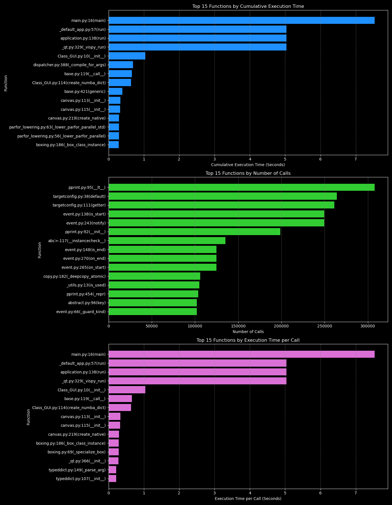

# Particle Life Simulator
### Group D

A dynamic particle simulation demonstrating emergent behavior through biology-inspired interaction rules.

## Table of Contents
1. [Overview](#overview)
2. [Installation](#installation)
3. [Setting Up the Environment](#setting-up-the-environment)
4. [Usage](#usage)
5. [Configuration](#configuration)
6. [Project Structure](#project-structure)
7. [Profiling](#profiling)
8. [License](#license)

---

## Overview
**Particle Life Simulator** is an interactive simulation that showcases emergent behavior by simulating the interactions of particles. Inspired by biological systems, particles move according to predefined attraction and repulsion rules between different groups.

**Key Features:**
- Real-time visualization using **VisPy**
- Efficient computation using **Numba** for fast parallel execution
- Interaction rules defined via an **interaction matrix**
- Benchmark mode to measure **FPS performance**
- Graphical user interface (GUI) for **simulation control**
- Profiling support for performance optimization

## How to use particle_life_simulator
A dynamic particle simulation demonstrating emergent behavior through biology-inspired interaction rules.

The project setup is documented in [project_setup.md](project_setup.md). Feel free to remove this document (and/or the link to this document) if you don't need it.

## Installation
To install particle_life_simulator from a GitHub repository, run:

    git clone https://github.com/<my-github-organization>/particle_life_simulator.git
    cd particle_life_simulator
    python -m pip install .
    # or on mac: python3 -m pip install .

## Setting Up the Environment
Ensure you have Conda installed on your system. You can download and install it from [Anaconda](https://www.anaconda.com/).

Run the following command in the terminal or command prompt to create the environment:

    conda env create -f environment.yml
    conda activate environment.yml

## Usage
(Include any specific usage instructions or examples here, if applicable. For example, you might run:)

    python main.py

## Configuration
The interaction rules and simulation parameters can be configured using an **interaction matrix**. This matrix defines the attraction/repulsion behavior between different groups of particles.

Example interaction matrix:

    interaction_matrix = np.array([
        [0,  0,  0,  0,  0],  # Red interactions
        [0,  0,  0,  0,  0],  # Blue interactions
        [0,  0,  0,  0,  0],  # Green interactions
        [0,  0,  0,  0,  0],  # Yellow interactions
        [0,  0,  0,  0,  0],  # Magenta interactions
    ], dtype=np.float32)

Modify this in `main.py` to adjust particle behavior.

---

## Project Structure
    particle_life_simulator/
    ├── particle_life/
    │   ├── __init__.py
    │   ├── Class_GUI.py        # GUI implementation using VisPy
    │   ├── Class_Particle.py   # Particle class with movement rules
    │   ├── Class_simulation.py # Simulation logic and FPS benchmarking
    ├── main.py                 # Entry point for the simulation
    ├── profiler.py             # Performance profiling script
    ├── config/
    │   └── default_config.yaml # Configuration file (if used)
    ├── tests/
    │   ├── test_simulation.py  # Unit tests (if applicable)
    │   ├── test_utils.py
    ├── environment.yml         # Conda environment setup
    ├── setup.py                # Package setup
    ├── README.md               # Project documentation
    ├── LICENSE                 # License file

---

## Profiling
To analyze the performance of the simulation, run:

    python profiling/profiler.py

This will generate:
- `profiling/profiling_results.txt` (human-readable performance statistics)
- `profiling/profiling_results.prof` (binary file for visualization tools like **SnakeViz**)

### Profiling Visualization
To better understand the performance bottlenecks, a visualization of the profiling data is available:

Run the following command to generate the visualization:

    python profiling/visualize_profiling.py

This will create:
- `profiling/profiling_visualization.png` (graphical representation of profiling results)

---

## License
Specify your project’s license here. Example:

    MIT License

Ensure you include a `LICENSE` file in the repository.

---

This README reflects the details from your uploaded Python files, providing a structured guide to your Particle Life Simulator.
